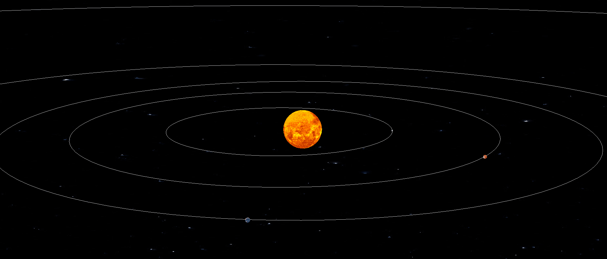

# 🌌 3D Solar System Simulator (Ursina Engine)

An interactive 3D simulation of a Solar System, developed in Python using the Ursina Engine.

### Project Preview


## 🔭 About the Project
This project is the result of a lifelong passion for astronomy and celestial dynamics. Inspired by technical studies in **"Introduction to Orbital Mechanics for Engineering Students"**, I translated theoretical principles into a functional 3D environment.

To ensure visual accuracy and realism, I used **official NASA imagery** for planetary textures and processed assets using **Blender** to create an immersive cosmic experience.

## 🚀 Features
* **Real-time 3D Rendering:** Smooth graphics and space environment powered by the Ursina Engine.
* **Celestial Mechanics:** Simulation of orbital motion based on engineering-level physics.
* **High-Fidelity Textures:** Planets and celestial bodies featuring authentic NASA-sourced visuals.
* **Interactive Exploration:** Full camera control (Pan, Zoom, Rotate) to explore the system from any angle.

## 🛠️ Technologies Used
* **Python:** Core logic and orbital calculations.
* **Ursina Engine:** 3D rendering and entity management.
* **Blender:** 3D asset optimization and texture mapping.
* **NASA Open Data:** High-resolution planetary textures.

## ⚙️ How to Run
1. Ensure you have Python installed.
2. Install the Ursina library: 
   ```bash
   pip install ursina
